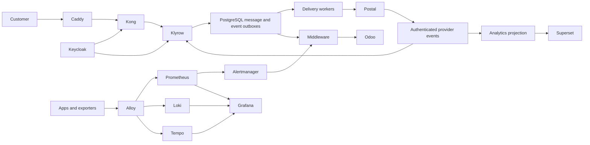

# Klyrow target architecture

The September 13 API-first mission pack is the target. Preserve the current
FastAPI/Vue/PostgreSQL/Postal/Mautic implementation while introducing compatible
contracts and independently scalable workers.

There is one external Odoo write arrow: Middleware → Odoo. Grafana and Superset
are readers. OpenBao owns infrastructure secrets, with the Odoo credential path
readable only by the Middleware workload identity. Neither Odoo nor telemetry
is a dependency of mail acceptance or delivery.

Public product APIs use `/v1/`. New private APIs use `/internal/v1/`; existing
`/v1/internal/*` and Middleware `/internal/provider-events/klyrow` paths require
explicit, authenticated compatibility handling until callers migrate. Do not
make an internal path public by adding an unrestricted alias.

The checked-in OpenAPI exports describe implemented behavior and are a baseline
for contract-first changes. Implement target-only operations with typed request
and response schemas, tenant authorization, durable idempotency and tests before
advertising them as available. Preserve existing response shapes while adding a
versioned migration for changed pagination or message IDs.

Implementation sequence:

1. M00: establish route, database, dependency, secret-reference and writer truth.
2. M01/M05/M06/M27: validate contracts, add compatibility checks and generated SDK proof; fill missing product operations and typed responses.
3. M07/M11–M14: normalize business summaries, durable Middleware inbox/outbox, bounded retries, DLQ/replay, existing-model Odoo mappings and reconciliation.
4. M15–M23/M25: OTLP propagation, central telemetry, read-only dashboards, independent signed customer webhooks.
5. M26/M29–M33: tenant and network denial tests, outage recovery, restore drills and production evidence.

Klyrow changes stay in this repository. Keycloak, OpenBao, Kong/Caddy, central
observability, Telnexa, VICIdial and the deployable Middleware application have
separate owners. A contract fixture in Klyrow cannot certify their live state.
